# ShipTrack — Shipment Tracking System template

[](https://uipkge-shipment-tracking-template.vercel.app)
[](https://nuxt.com)
[](https://vuejs.org)
[](https://tailwindcss.com)
[](https://uipkge.dev)
[](#license)

A reference **shipment tracking & logistics** dashboard built end-to-end on
the [uipkge](https://uipkge.dev) UI registry. Every screen runs on
hand-built **mock data** — no backend, no database, no API keys — so it's
ready to demo to clients out of the box and easy to copy as a starting
point for a real build.

**▶ Live demo: [uipkge-shipment-tracking-template.vercel.app](https://uipkge-shipment-tracking-template.vercel.app)**

## ★ Live fleet tracking

The headline feature: a real-time fleet map built on **Mapbox GL JS**. Every
active trip is drawn as a real road polyline over a live basemap, alongside a
trip list and a click-through **inspector drawer** with per-trip stops,
distance, and status.

| Light | Dark |
| --- | --- |
| [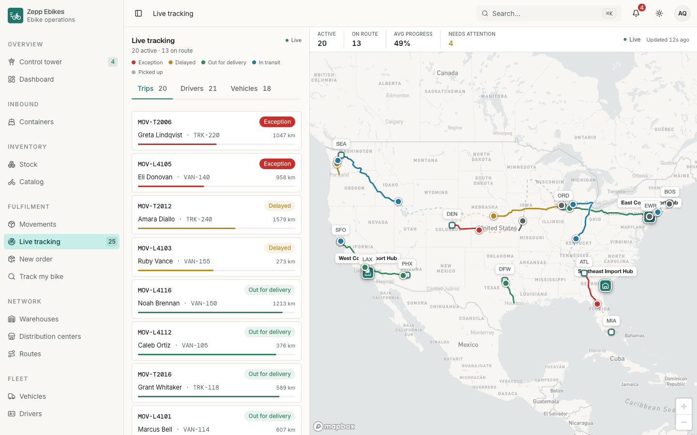](https://uipkge-shipment-tracking-template.vercel.app/live) | [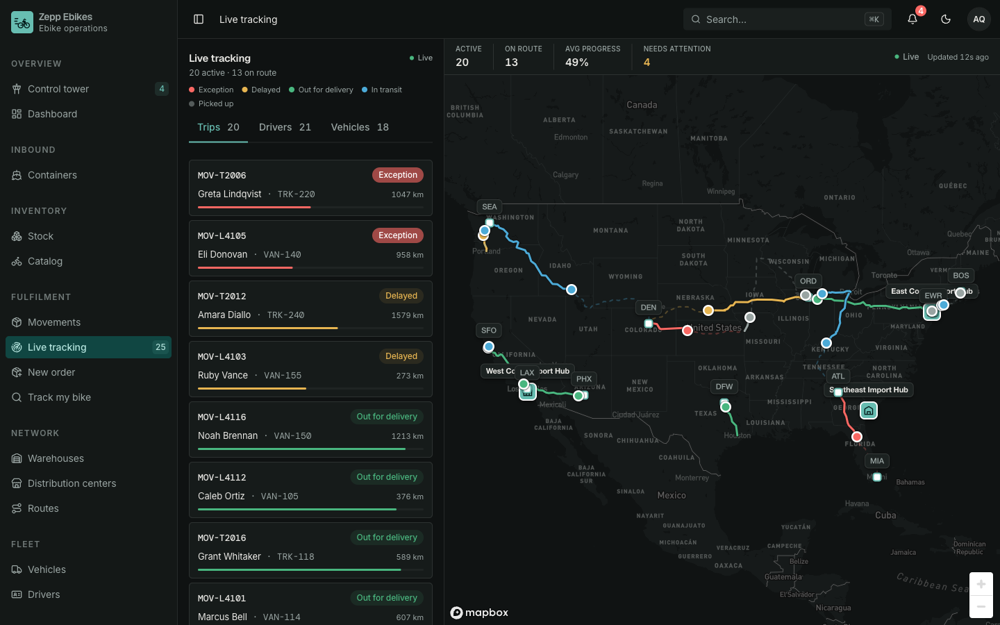](https://uipkge-shipment-tracking-template.vercel.app/live) |

**▶ Try it live → [uipkge-shipment-tracking-template.vercel.app/live](https://uipkge-shipment-tracking-template.vercel.app/live)**

## Screenshots

| Operations dashboard | Shipment detail |
| --- | --- |
| [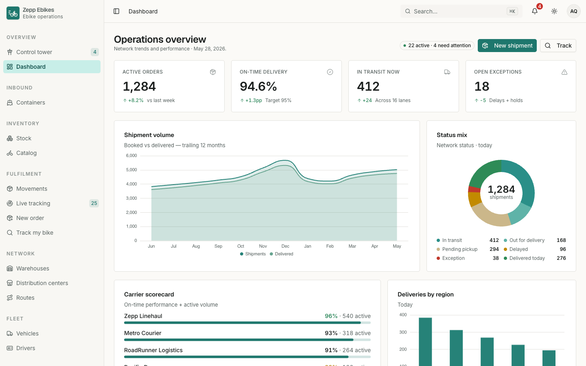](docs/screenshots/dashboard-light.png) | [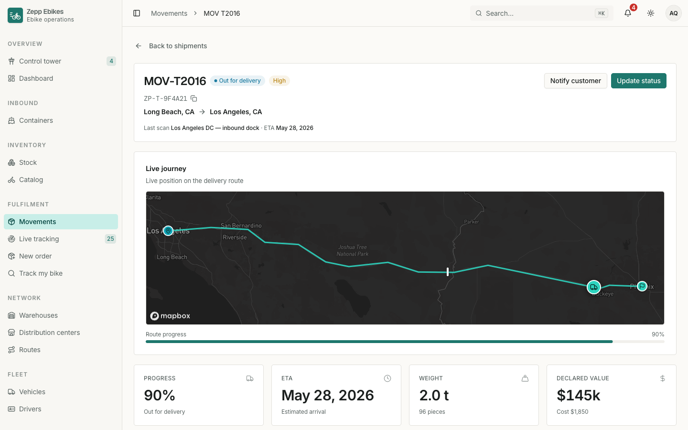](docs/screenshots/shipment-detail-light.png) |
| **Analytics** | **Movements ledger** |
| [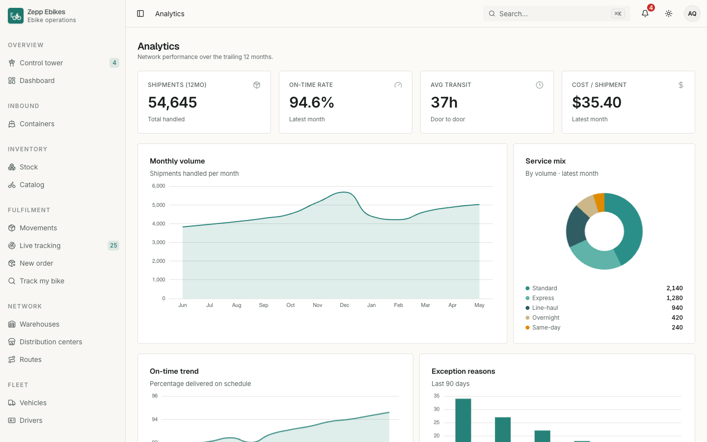](docs/screenshots/analytics-light.png) | [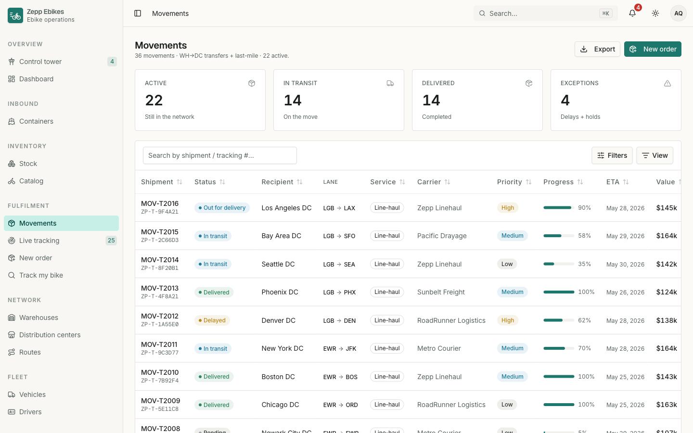](docs/screenshots/shipments-table-light.png) |
| **Fleet & utilization** | **Public package tracking** |
| [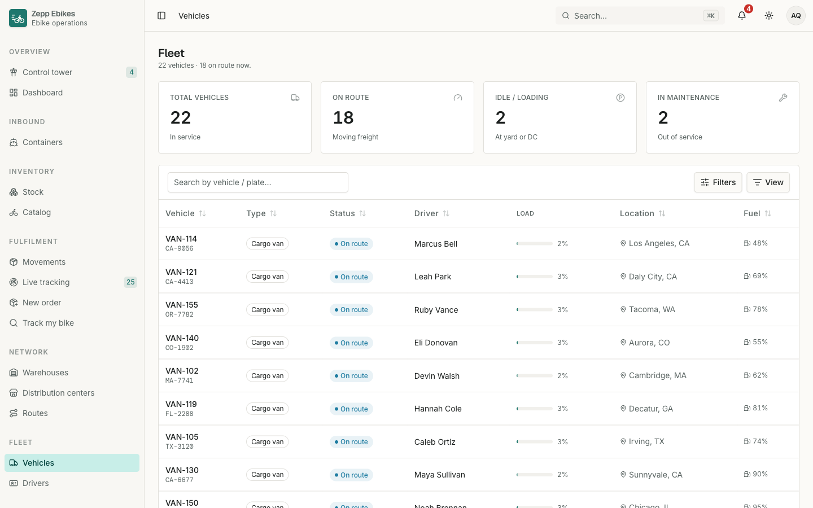](docs/screenshots/fleet-light.png) | [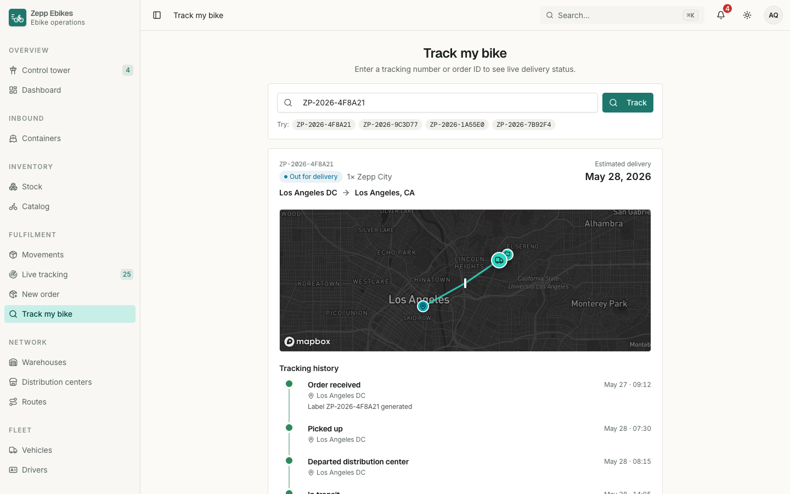](docs/screenshots/tracking-light.png) |

<details>
<summary><b>Dark mode</b> (the theme is cookie-backed, so it's SSR-correct on first paint)</summary>

| Operations dashboard | Shipment detail |
| --- | --- |
| [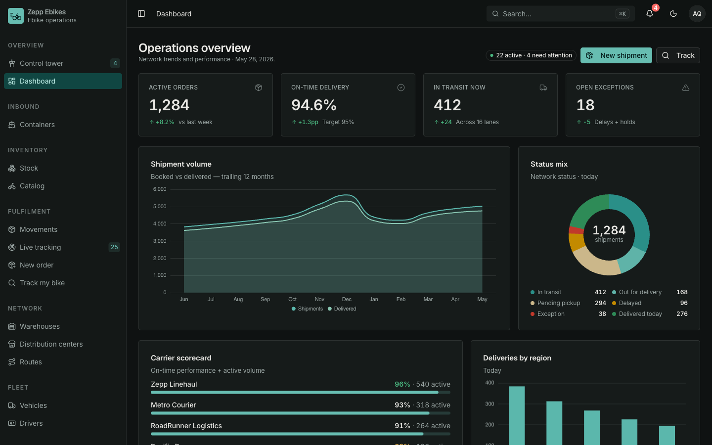](docs/screenshots/dashboard-dark.png) | [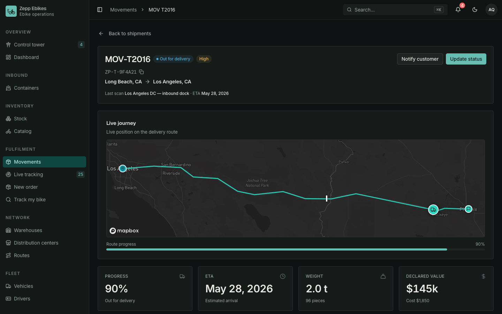](docs/screenshots/shipment-detail-dark.png) |
| **Analytics** | **Movements ledger** |
| [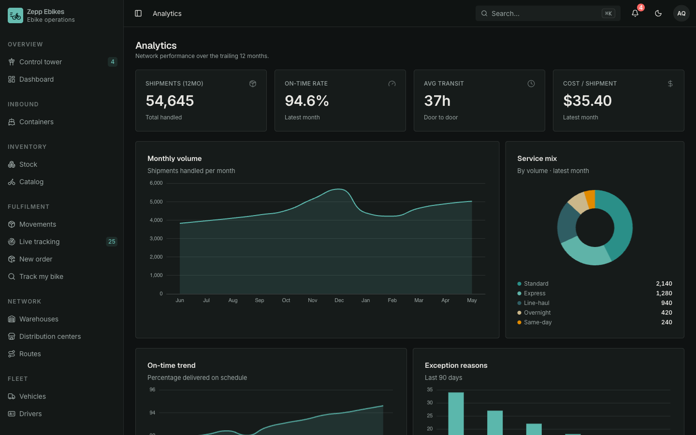](docs/screenshots/analytics-dark.png) | [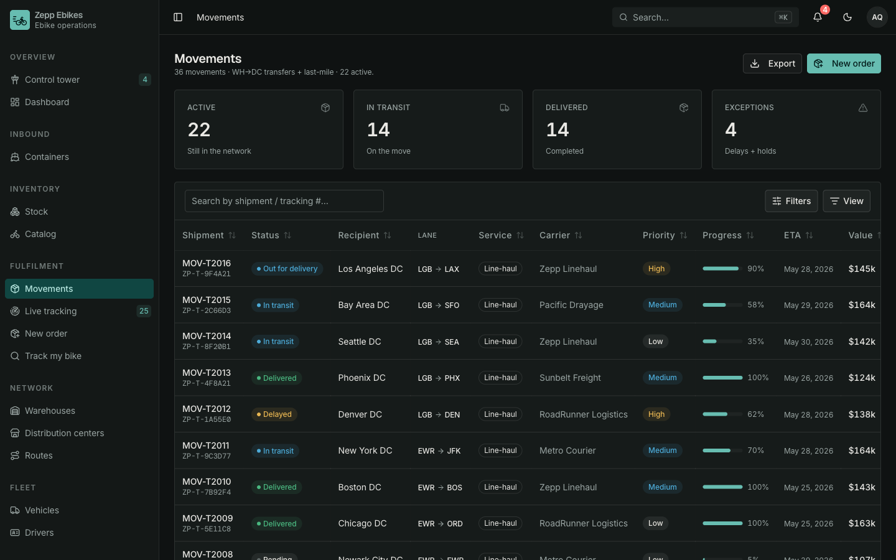](docs/screenshots/shipments-table-dark.png) |
| **Fleet & utilization** | **Public package tracking** |
| [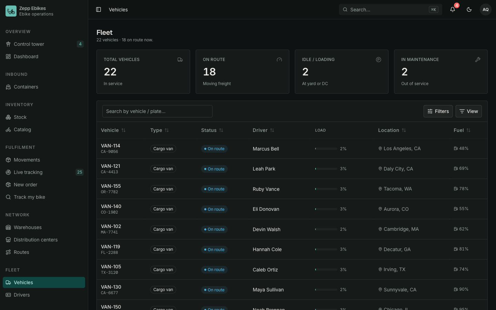](docs/screenshots/fleet-dark.png) | [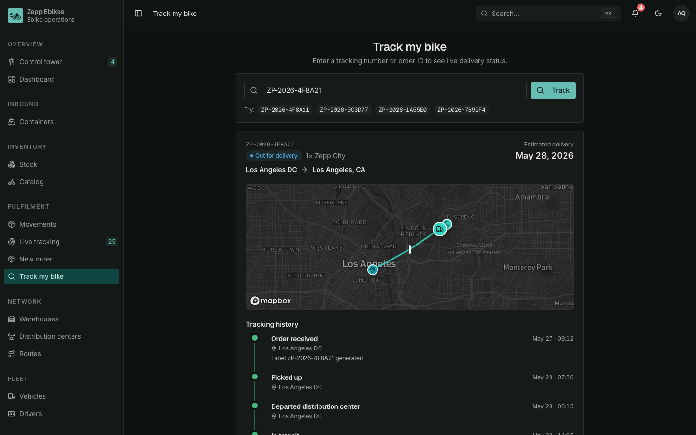](docs/screenshots/tracking-dark.png) |

</details>

## Tech stack

- **Framework** — Nuxt 4 + Vue 3 (Composition API, `<script setup>`)
- **UI components** — shadcn-vue primitives from the `@uipkge` registry on [Reka UI](https://reka-ui.com)
- **Styling** — Tailwind CSS v4 with OKLCH design tokens (light + dark)
- **Maps** — Mapbox GL JS for the live fleet map (`/live`)
- **Charts** — ECharts via `vue-echarts`
- **Tables** — TanStack Table (`@tanstack/vue-table`)
- **State** — `useState` + composables (no Pinia)
- **Icons** — `lucide-vue-next`
- **Toasts** — `vue-sonner`

## Getting started

```bash
npm install
cp .env.example .env   # optional — only the /live Mapbox map needs a token
npm run dev            # http://localhost:3340
```

```bash
npm run build    # production build
npm run preview  # preview the build
```

Requires Node 20+ (see `.nvmrc`).

### Environment

| Variable | Required | What it's for |
| --- | --- | --- |
| `MAPBOX_ACCESS_TOKEN` | Optional | Powers the live fleet-tracking map at `/live`. Get a free token at [account.mapbox.com](https://account.mapbox.com/access-tokens/). Every other screen runs on mock data without it. |

Exposed to the client via `runtimeConfig.public.mapboxToken` (see `nuxt.config.ts`).

## Personas

The demo simulates three roles. Switch from the **topbar avatar menu** or
**Settings → Profile** (persisted in `localStorage`):

| Persona | Sees |
| --- | --- |
| **Operations Admin** | Everything, plus the workspace-admin Organization tab |
| **Dispatcher** | Shipments, fleet, drivers, routes, warehouses, customers, analytics |
| **Customer** | The shipment ledger + public tracking lookup only |

Persona gating happens at nav-render time (`app/lib/nav.ts`) and via
route middleware (`app/middleware/require-dispatcher.ts`,
`require-admin.ts`).

## Pages

| Route | What it shows |
| --- | --- |
| `/dashboard` | Control-tower overview: KPIs, volume trend, status mix, carrier scorecard, regional split, live activity feed |
| `/shipments` | Filterable, sortable shipment ledger (data table) with a `?status=` deep-link filter |
| `/shipments/[id]` | Shipment detail — status hero, route progress, tracking timeline, packages, documents |
| `/shipments/new` | Mock booking form (dispatcher) |
| `/live` | Live fleet map (Mapbox GL JS) with per-trip route polylines + an inspector drawer |
| `/tracking` | Public-style "track a package" lookup by tracking number |
| `/fleet` | Vehicle roster with utilization + status (dispatcher) |
| `/drivers` | Driver roster card grid (dispatcher) |
| `/routes` | Network lanes with live shipment load (dispatcher) |
| `/warehouses` · `/distribution-centers` | Capacity + throughput across the network (dispatcher) |
| `/customers` | Account directory with derived shipment stats (dispatcher) |
| `/analytics` | Performance charts: volume, on-time trend, service mix, exceptions, top lanes (dispatcher) |
| `/settings` | Profile, appearance (live theme), notifications, integrations, organization (admin) |
| `/auth/sign-in` | Mock sign-in with persona quick-select |

## Mock data

All data is hand-built in `app/mocks/*.ts` — **no `Math.random`, no
`Date.now()` at module scope** — so server and client render identical
markup (no hydration drift). The demo "now" is anchored to a
`TODAY` constant in `app/mocks/shipments.ts`.

| File | Contents |
| --- | --- |
| `shipments.ts` / `movements.ts` | The shipment ledger (the source of truth) + status/service/priority maps + formatters |
| `shipment-detail.ts` | Tracking timeline, packages, documents, route stops — *derived deterministically* from each shipment |
| `fleet.ts` · `drivers.ts` · `routes.ts` · `warehouses.ts` | Fleet network entities, cross-referenced by id with shipments |
| `customers.ts` | Accounts; shipment stats are derived live from the ledger |
| `dashboard.ts` · `analytics.ts` | Aggregate KPIs, trends, and series |

To wire a real backend, swap the static imports for `useFetch('/api/…')`
returning the same shapes — the page-side transformations stay identical.

## Project structure

```
app/
├── components/
│   ├── ui/            # @uipkge registry primitives (buttons, cards, table, charts…)
│   ├── blocks/        # composed blocks (sidebar, command palette)
│   ├── nav/           # topbar + breadcrumb
│   └── KpiTile.vue    # the app-specific KPI tile
├── composables/       # usePersona, useTheme, useDataReady, useGlobalShortcuts…
├── layouts/           # default app shell (sidebar + topbar)
├── lib/               # nav tree + utils (tone helpers, date formatting)
├── middleware/        # persona route guards
├── mocks/             # hand-built mock data
└── pages/             # file-based routes
server/plugins/        # theme FOUC-prevention plugin
```

## Live demo & related templates

This template is part of a family of reference apps that all consume the
[uipkge](https://uipkge.dev) UI registry — same design system, different domains:

| Template | Domain | Links |
| --- | --- | --- |
| **ShipTrack** (this repo) | Shipment tracking & logistics | [Live demo](https://uipkge-shipment-tracking-template.vercel.app) · [Repo](https://github.com/uday-a/uipkge-shipment-tracking-template) |
| **uipkge HMS** | Hospital / clinic management | [Repo](https://github.com/uday-a/uipkge-hms-nuxt-template) |
| **uipkge HRMS** | HR / people management | [Repo](https://github.com/uday-a/uipkge-hrms-nuxt-template) |

## Notes

- The `@uipkge` registry components live in `app/components/ui/**` and are
  treated as vendored — extend via wrappers rather than editing in place.
- Charts render client-side only (wrapped in `<ClientOnly>`), and the theme
  is read from a cookie before first paint, so there's no hydration flicker.
- Keyboard shortcuts: `g`-chords navigate (`g d` dashboard,
  `g s` shipments, `g t` tracking, …) and `/` opens the command palette.

## License

MIT.
